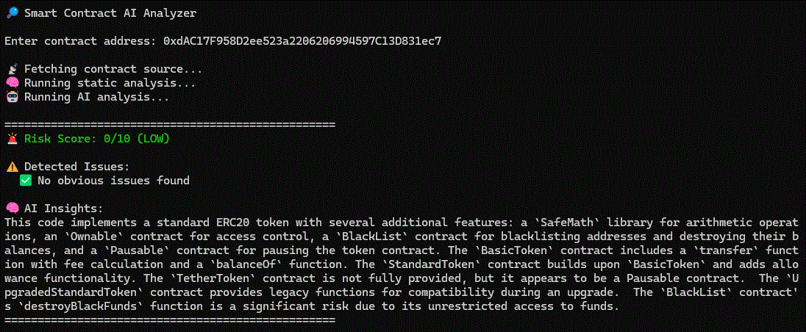

# 🛡️ Smart Contract AI Analyzer




An AI-powered command-line tool that analyzes Ethereum smart contracts for potential security risks and vulnerabilities.

This tool combines **static analysis (rule-based detection)** with **LLM-powered reasoning** to provide structured insights about contract safety.

---

## 🚀 Features

- 🔎 Analyze smart contracts using contract address
- 🧠 AI-powered security insights (LLM-based)
- ⚠️ Static vulnerability detection (reentrancy, access control, etc.)
- 🎯 Risk scoring (0–10)
- 🎨 Color-coded CLI output (Low / Medium / High risk)
- 🧩 Combines deterministic rules + AI reasoning

---

## 🧠 How It Works

1. User enters a contract address  
2. Tool fetches verified source code from Etherscan  
3. Static analysis detects known vulnerabilities  
4. AI analyzes deeper patterns and provides insights  
5. Results are merged and displayed in terminal  

---

## 🛠️ Tech Stack

- Python
- Requests (API calls)
- OpenRouter (LLMs)
- Etherscan API (contract source)
- dotenv (environment variables)

---

## 💡 Why This Project?

Smart contract security is critical in Web3, but audits are expensive and time-consuming.

This tool provides:
- Instant AI-powered insights
- Pre-audit risk detection
- Developer-friendly explanations

It bridges the gap between traditional static analysis and modern AI reasoning.

---

## 🎥 Demo

```bash
$ python main.py
```

🔎 Smart Contract AI Analyzer

Enter contract address: 0xdAC17F...

🚨 Risk Score: 6/10 (MEDIUM)

⚠️ Detected Issues:
- Reentrancy Risk (high)

🧠 AI Insights:
...

---

## ⚙️ Installation

### 1. Clone the repository

```bash
git clone https://github.com/hotnerd000/AI_Resume_Analyzer.git
cd smart-contract-ai-analyzer
```

### 2. Create virtual environment

```bash
python -m venv venv
venv\Scripts\activate
```

### 3. Install dependencies

```bash
pip install -r requirements.txt
```

### 4. Create `.env` file

```env
OPENROUTER_API_KEY=your_api_key_here
ETHERSCAN_API_KEY=your_etherscan_key_here
```

---

## ▶️ Usage

Run the tool:

```bash
python main.py
```

Then enter a contract address:

```text
Enter contract address: 0xdAC17F958D2ee523a2206206994597C13D831ec7
```

---

## 📊 Example Output

```
🚨 Risk Score: 6/10 (MEDIUM)

⚠️ Detected Issues:
- Reentrancy Risk (high)
- Missing Access Control (medium)

🧠 AI Insights:
The contract shows moderate risk due to external call usage...
```

---

## 🔍 Detected Vulnerabilities

- Reentrancy attacks
- Missing access control
- tx.origin misuse
- delegatecall risks
- Integer overflow (older Solidity)
- Selfdestruct usage

---

## ⚠️ Limitations

- Only works with verified contracts (Etherscan)
- AI analysis may not be 100% accurate
- Not a replacement for professional security audits

---

## 🔮 Future Improvements

- Multi-chain support (BSC, Polygon)
- Slither integration for deeper analysis
- Web UI (FastAPI or React frontend)
- PDF report generation
- Contract address batch analysis

---

## 💼 Use Cases

- Web3 developers testing contracts
- Security researchers
- DeFi project teams
- Freelancers offering audit pre-check tools

---

## 👨‍💻 Author

AI + Web3 Developer specializing in:
- Smart contract analysis
- AI-powered tools
- Blockchain security

Available for freelance projects.

---

## 🔮 Roadmap

- Integrate Slither for deeper static analysis
- Add multi-chain support (Polygon, BSC)
- Web dashboard (FastAPI + React)
- Batch contract analysis

---

## ⭐ Support

If you find this project useful, consider giving it a ⭐ on GitHub!
